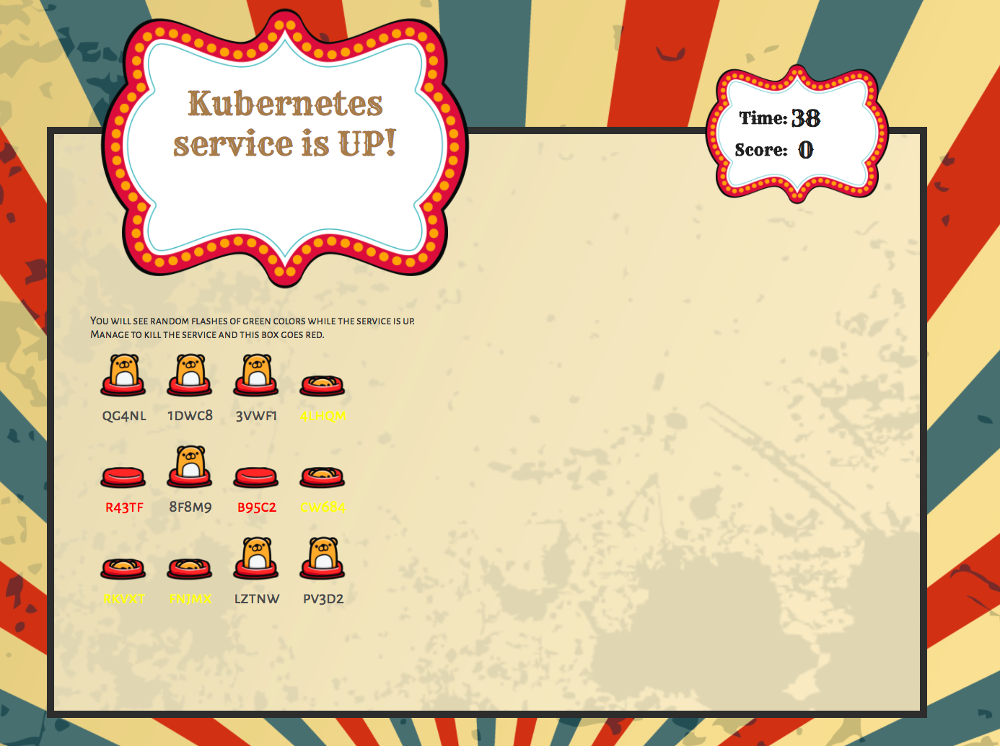
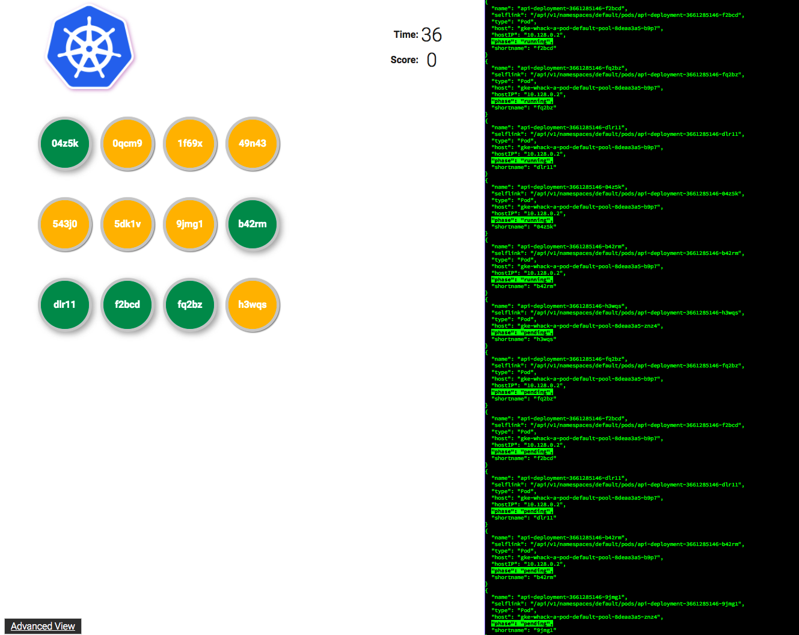
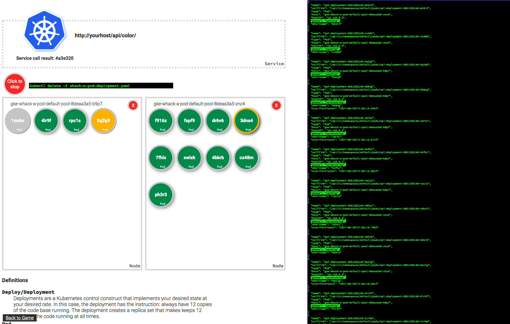

# Fontys Open Day 2024
## Whack-a-pod
Borrowed from: https://github.com/tpryan/whack_a_pod

This is a demo that can be used to show how resilient services running on
Kubernetes can be. Main app shows a giant sign that flashes in various random
colors.  Those colors come a Kubernetes powered microservice.  If the service
goes down, the sign turns red. Your goal is to try and knock the service down
by killing the Kubernetes pods that run the service. You can do that by
whacking the pods wich are respresented as moles.



There is also a less busy verison of the game available at /next.html. This
version has an advanced mode that allows someone to do a more visual
explanation of the mechanics.



The advanced version allows you to track the pod that is serving the color
service and to simulate creating and destroying nodes.



## Getting Started

### Install kubectl
The current directions assume you have kubectl installed and pointed to the installable kubernetes cluster. If not, install it using the command below
```
curl -LO "https://dl.k8s.io/release/$(curl -L -s https://dl.k8s.io/release/stable.txt)/bin/linux/amd64/kubectl"
```

### Install make
The containers are build and created using makefile

` sudo apt-install make `


### Create Configs 
1. Check the  `/Makefile.properties`
1. Alter value for `PROJECT` to your project id
1. Set `INGRESSNAME` if you need to use something other than the default. 
1. Set `DOCKERREPO` if you need to use something other Docker Container Registry. 


### Build Application
1. Open a terminal in root of whack_a_pod location.
1. Run `make build`.
`make build` will do the following:
    1. Build the containers. Go is needed for that
    2. Push them to the docker repository
    Your repository should have three new images with the tags:
        - admin
        - api
        - game

For example, if your username is `username` and your repository name is `wap`, your images will be pushed to:
    - username/wap:admin
    - username/wap:api
    - username/wap:game

### Deploy Application
1. Open a terminal in root of whack_a_pod location.
1. Run `make deploy`

## Run demo
There are two skins to the game.
1. Carnival version:
    *  http://[gamehost]/
1. Google Cloud Next branded version:
    * http://[gamehost]/next.html
    * http://[gamehost]/advanced.html

The advanced version of the game is a great demo for teaching some of the
fundamentals of Kubernetes.  It allows you to cordon and uncordon nodes of the
Kubernetes cluster to simulate Node failure. In addition it shows which Pod of
the Replica Set is actually answering calls for the service.

### Clean Up
1. Open a terminal in `/`.
1. Run `make clean`


## Architecture
There are three Kubernetes services that make up the whole application:
1. Game
Game contains all of the front end clients for the game, both the carnival
version and the Google Cloud Next version.
1. Admin
Admin contains all of the logic for managing the whole application.  This is
the application the front end calls to get a list of the pods running the
color api, it also has calls to create and delete deployments, delete pods, and
drain and uncordon nodes.
1. Api
Api contains two service calls: color and color-complete. Color is a random
hexidecimal RGB color value. Color-complete is the same as color, but also
sends the pod name of the pod that answered the service call.


"This is not an official Google or Fontys Project."
